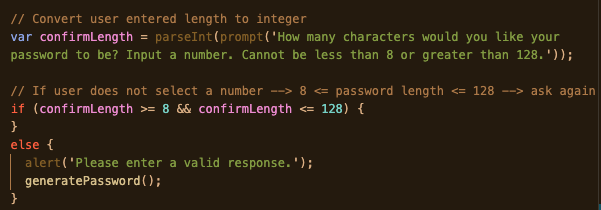
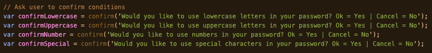
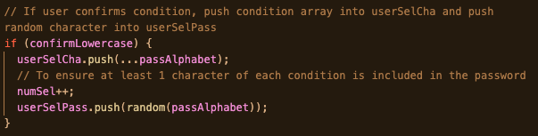
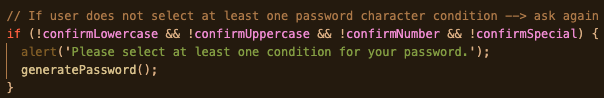
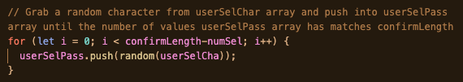
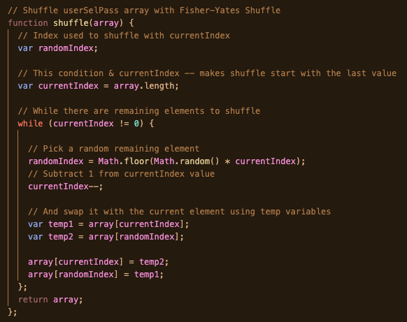
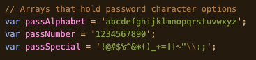
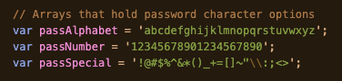

# Challenge 3 - Password Generator

## Purpose

The purpose of this project was to create an application for a client that an employee can use to generate a password that meets criteria the employee has selected. 

## Built With

## Table of Contents

- [User Story](#challenge---user-story)
- [Acceptance Criteria](#challenge---acceptance-criteria)
- [Application Website Link](#application-website-link)
- [JavaScript Code](#javascript-code)
- [Challenges](#challenges)
- [Credits](#credits)

## Challenge - User Story

This a description of the requirements for the application requested by the client:

- AS AN employee with access to sensitive data I WANT to randomly generate a password that meets certain criteria SO THAT I can create a strong password that provides greater security.

## Challenge - Acceptance Criteria

The following criteria for the application had to be met:

GIVEN I need a new, secure password
- WHEN I click the button to generate a password  
  THEN I am presented with a series of prompts for password criteria
- WHEN prompted for password criteria  
  THEN I select which criteria to include in the password
- WHEN prompted for the length of the password  
  THEN I choose a length of at least 8 characters and no more than 128 characters
- WHEN asked for character types to include in the password  
  THEN I confirm whether or not to include lowercase, uppercase, numeric, and/or special characters
- WHEN I answer each prompt  
  THEN my input should be validated and at least one character type should be selected
- WHEN all prompts are answered  
  THEN a password is generated that matches the selected criteria
- WHEN the password is generated  
  THEN the password is either displayed in an alert or written to the page

## Application Website Link

[Password Generator](https://jessoliva.github.io/password-generator/)

## JavaScript Code

To build this application, I wrote code that overall does the following:
- Asks the user to input a password length meeting this criteria: 8 ≤ password length ≤ 128
    - If criteria is not met, user is alerted and asked to input a valid value
    

    &emsp;&emsp;&emsp; 
    

- Asks user if they want their password to include: lowercase letters, uppercase letters, numbers, special characters
    - When the user confirms a condition
        - The array linked to the condition confirmed is pushed into an empty array userSelCha
            - userSelCha will hold all the array characters from the conditions confirmed
        - A random character from the array of linked condition confirmed is pushed into an empty array userSelPass
            - userSelPass will hold the user password
    - If user does not select any conditions, user is alerted that at least one condition must be selected

&emsp;&emsp;&emsp; 

&emsp;&emsp;&emsp; 

&emsp;&emsp;&emsp; 

- Loops through the userSelCha array which holds all the characters from the arrays linked to the conditions confirmed by the user. For loop retrieves a random character from that array and adds it to the userSelPass array until the password length the user input is reached

&emsp;&emsp;&emsp; 

- Uses the Fisher-Yates shuffle to shuffle the userSelPass array and return a final password for the user

&emsp;&emsp;&emsp; 

## Challenges

As I was writing my code for this application, I came across several challenges. I solved those challenges in my code a specific way. This section will discuss those challenges, how I tackled them, and other ways to solve them.

### Challenge 1
#### Problem
Once the user confirmed a condition, and the array linked to that condition was pushed to userSelCha, a for loop looped through that array and retrieved and pushed a random character into the userSelPass array until the password length the user input was met.
Since the passNumber and passSpecial arrays were shorter than the letter arrays due to less numbers and special characters, there was a chance that shorter passwords would not contain a character from each condition if the user confirmed all the conditions.

#### Solution
Once the user confirmed a condition, I pushed a random character from that array into userSelPass to ensure at least one character from each confirmed condition was in the password.

### Challenge 2
#### Problem
The previous solution led to the password (userSelPass array) having its first few characters be from whichever conditions the user confirmed in order. 
- For example, if the user said yes to all conditions each time they created a password, those passwords would include (lowercase letter)(uppercase letter)(number)(special character)(remainder of password characters would be truly random)

#### Solution
I learned about the Fisher-Yates shuffle and used it to shuffle the userSelPass so the passwords could be truly random.

### Challenge 1 and Challenge 2
#### Alternate Solution
Instead of doing all that, I could have modified the arrays holding the characters linked to the password conditions, and just added more characters to the shorter arrays. This would lead to each array having almost an equal amount of values and lowering the probability of shorter passwords not including a character from each confirmed condition.
But! I had fun learning about the Fisher-Yates shuffle and wanted to use it.

- My Arrays

&emsp;&emsp;&emsp; 

- Alternate Arrays

&emsp;&emsp;&emsp; 

### Alternate Code
I also learned about slice(). Instead of using a for loop, I could've just shuffled the userSelCha array and sliced it! To only keep a number of characters that matches the password length the user input.  
- Very basic example:  
    - user input confirmLength = 5  
    - var userSelCha = "lk!A2sf;liKD94j#$2;ab" //already shuffled  
    - userSelCha.slice(0, (confirmLength-1)) //slice it  
    - userSelCha = "lk!A2"

## Credits
- Mike Bostock - [Fisher-Yates Shuffle](https://bost.ocks.org/mike/shuffle/)
- James Bub - [Fisher-Yates Algorith](https://dev.to/codebubb/how-to-shuffle-an-array-in-javascript-2ikj)
- [Stack Overflow: Fisher-Yates Shuffle](https://stackoverflow.com/questions/2450954/how-to-randomize-shuffle-a-javascript-array)
- Badges - [Shields.io](https://shields.io/)